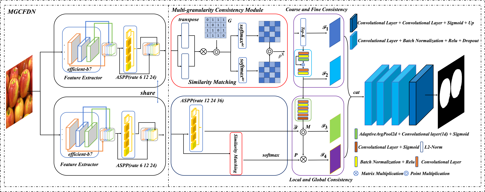
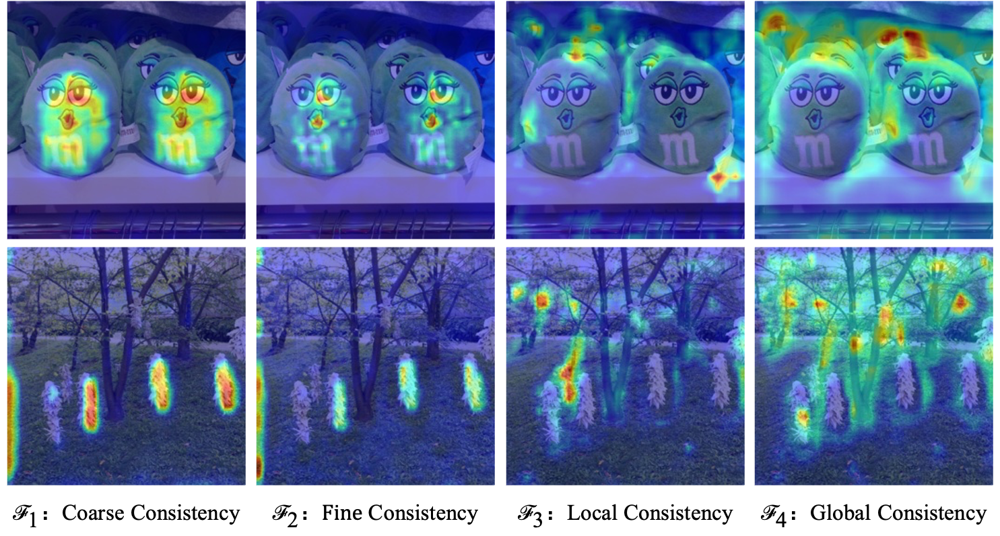

# MGCFDN: An Image Copy-Move Forgery Detection Method Based on Multi-Granularity Feature Consistency

#### algorithm framework diagram


In this repository, we release many paper related things, including
- version dependency of our code environment
- a pretrained MGCFDN model weight,to be updated [weight](https://pan.baidu.com/s/1ZAPkaXl0S38kinP2wggQ1Q?pwd=2uwg)
- USC-ISI CMFD,CASIA CMFD, DEFACTO CMFD,COVERAGE,and CoMoFoD dataset ,to be updated [dataset](https://pan.baidu.com/s/1xHjjCgZKay6vU1fQeY6nhg?pwd=263y)
- training and testing of our methods, preprocessing steps, hyperparameter tuning

1.The environment for our code can execute the following command:
`
pip install -r requirements.txt
`

2.You can evaluate performance by testing different data:
`
python test_score.py
python test_st_core.py
`

3.You can also use this code to predict fake areas of fake images:
`
python test.py
`

Please observe the license agreement for our code [license](LICENSE).

#### Visual visualization of four consistency features


## Citation
* If you find it helpful for you, please consider citing our paper 📝 and giving a star ⭐.
```
@article{TU2025132029,
    title = {MGCFDN: Image copy-move forgery detection method based on multi-granularity feature consistency},
    author = {Hang Tu and Peng Liang and Xiaoguang Lu and Huimin Zhao}
    journal = {Neurocomputing},
    pages = {132029},
    year = {2025},
    doi = {https://doi.org/10.1016/j.neucom.2025.132029}
}
```